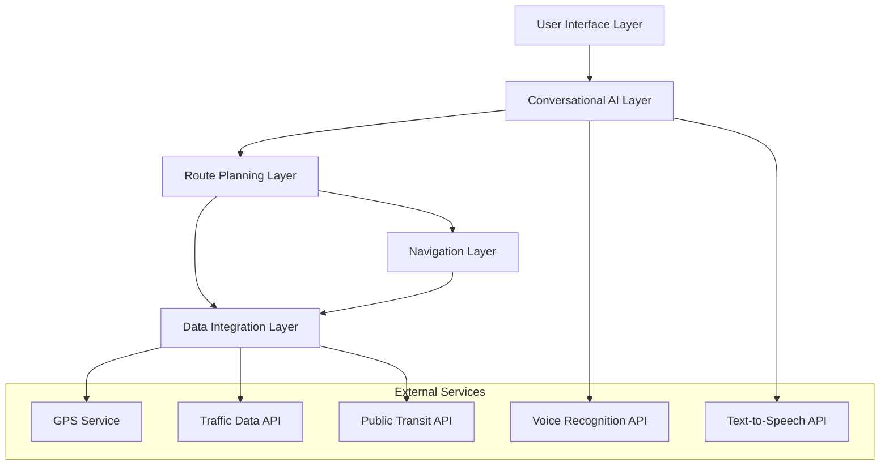
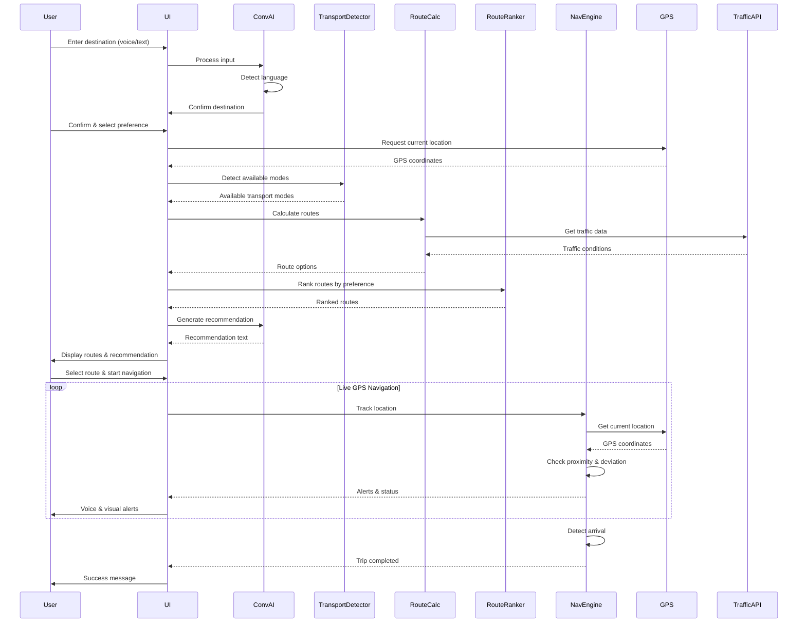
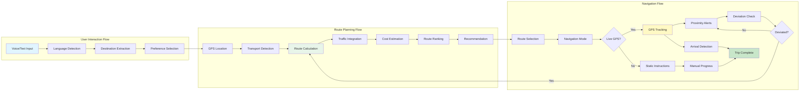

# Design Document: Raahé 

## Overview

Raahé is a multilingual, AI-powered tourist navigation system optimized for Indian cities. The system integrates real-time GPS tracking, dynamic transport mode detection, traffic analysis, and conversational AI to provide personalized route recommendations with live navigation support.

The architecture follows a modular design with clear separation between:
- Transport detection and availability checking
- Route calculation and ranking engines
- Real-time GPS tracking and navigation
- Multilingual voice and text processing
- Conversational AI interface

## Architecture

### System Architecture Diagram

```mermaid
graph TB
    subgraph "Client Layer - Mobile App"
        UI[User Interface]
        VoiceInput[Voice Input Handler]
        VoiceOutput[Voice Output Handler]
        GPSModule[GPS Module]
        MapDisplay[Map Display]
    end
    
    subgraph "Application Layer - Backend Services"
        API[API Gateway]
        
        subgraph "Core Services"
            TransportDetector[Transport Mode Detector]
            RouteCalc[Route Calculator]
            RouteRanker[Route Ranker]
            RecommendationGen[Recommendation Generator]
            NavEngine[Navigation Engine]
            DeviationDetector[Deviation Detector]
            ProximityAlert[Proximity Alert Manager]
        end
        
        subgraph "AI Services"
            LangDetector[Language Detector]
            ConvAI[Conversational AI]
            ContextManager[Context Manager]
            ResponseGen[Response Generator]
        end
        
        subgraph "Integration Services"
            TrafficIntegrator[Traffic Data Integrator]
            CostEstimator[Cost Estimator]
            TransitDataService[Transit Data Service]
        end
    end
    
    subgraph "Data Layer"
        LocationDB[(Location Database)]
        TransportDB[(Transport Network DB)]
        FareDB[(Fare Database)]
        TrafficCache[(Traffic Cache - Redis)]
        SessionStore[(Session Store)]
    end
    
    subgraph "External Services"
        GoogleMaps[Google Maps API]
        TrafficAPI[Traffic Data API]
        GTFS[GTFS Transit Feeds]
        SpeechToText[Speech-to-Text API]
        TextToSpeech[Text-to-Speech API]
        LLM[LLM API - GPT/Gemini]
        CabAPI[Cab Pricing API]
    end
    
    %% Client to Backend
    UI --> API
    VoiceInput --> API
    GPSModule --> API
    API --> VoiceOutput
    API --> MapDisplay
    
    %% API Gateway to Core Services
    API --> TransportDetector
    API --> RouteCalc
    API --> NavEngine
    API --> ConvAI
    
    %% Core Service Dependencies
    TransportDetector --> LocationDB
    TransportDetector --> TransportDB
    
    RouteCalc --> TransportDetector
    RouteCalc --> TrafficIntegrator
    RouteCalc --> CostEstimator
    RouteCalc --> GoogleMaps
    
    RouteRanker --> RouteCalc
    RouteRanker --> TrafficIntegrator
    
    RecommendationGen --> RouteRanker
    RecommendationGen --> LangDetector
    RecommendationGen --> ResponseGen
    
    NavEngine --> ProximityAlert
    NavEngine --> DeviationDetector
    NavEngine --> GPSModule
    
    DeviationDetector --> RouteCalc
    
    %% AI Service Dependencies
    ConvAI --> LangDetector
    ConvAI --> ContextManager
    ConvAI --> ResponseGen
    ConvAI --> LLM
    
    LangDetector --> SpeechToText
    ResponseGen --> TextToSpeech
    
    ContextManager --> SessionStore
    
    %% Integration Service Dependencies
    TrafficIntegrator --> TrafficAPI
    TrafficIntegrator --> TrafficCache
    TrafficIntegrator --> GoogleMaps
    
    CostEstimator --> FareDB
    CostEstimator --> CabAPI
    
    TransitDataService --> GTFS
    TransitDataService --> TransportDB
    
    %% External API Connections
    VoiceInput -.-> SpeechToText
    VoiceOutput -.-> TextToSpeech
    
    style UI fill:#e1f5ff
    style API fill:#fff3e0
    style ConvAI fill:#f3e5f5
    style RouteCalc fill:#e8f5e9
    style NavEngine fill:#fff9c4
    style GoogleMaps fill:#ffebee
    style LLM fill:#f3e5f5
```



### High-Level Architecture



### Data Flow Diagram



### Component Interaction Diagram



### Component Architecture

The system is organized into the following major components:

1. **User Interface Layer**: Handles user input (text/voice), displays route options, and manages navigation UI
2. **Conversational AI Layer**: Processes natural language, maintains context, detects language, and generates responses
3. **Route Planning Layer**: Detects transport modes, calculates routes, ranks options, and estimates costs/times
4. **Navigation Layer**: Provides real-time GPS tracking, proximity alerts, deviation detection, and route recalculation
5. **Data Integration Layer**: Interfaces with external APIs for GPS, traffic, transit schedules, and pricing

## Components and Interfaces

### 1. Transport Mode Detector

**Responsibility**: Determine which transport modes are available at a given location.

**Interface**:
```
function detectAvailableTransportModes(location: GPSCoordinates, destination: GPSCoordinates): TransportMode[]

Input:
  - location: Current GPS coordinates
  - destination: Target GPS coordinates

Output:
  - Array of available TransportMode (metro, bus, auto, cab, walking)

Behavior:
  - Query location database to determine city type (metro/rural)
  - Check metro station proximity (within 1km)
  - Check bus stop proximity (within 500m)
  - Always include auto and cab if in urban area
  - Always include walking if distance < 800m
  - Return filtered list of available modes
```

### 2. Route Calculator

**Responsibility**: Calculate complete route options for each available transport mode.

**Interface**:
```
function calculateRouteOptions(
  start: GPSCoordinates,
  destination: GPSCoordinates,
  availableModes: TransportMode[],
  trafficData: TrafficConditions
): RouteOption[]

Input:
  - start: Starting GPS coordinates
  - destination: Target GPS coordinates
  - availableModes: List of available transport modes
  - trafficData: Current traffic conditions

Output:
  - Array of RouteOption, each containing:
    - transportModes: Sequence of transport modes used
    - distance: Total distance in meters
    - estimatedTime: Total time in minutes
    - estimatedCost: Total cost in rupees
    - trafficImpact: Traffic level (low/medium/high)
    - transferCount: Number of vehicle changes
    - walkingDistance: Total walking in meters
    - steps: Detailed step-by-step instructions

Behavior:
  - For each transport mode, calculate optimal path
  - Consider multi-modal routes (e.g., walk + metro + auto)
  - Integrate real-time traffic data for time estimates
  - Calculate costs based on distance and mode pricing
  - Count transfers between different vehicles/modes
  - Sum all walking segments
```

### 3. Route Ranker

**Responsibility**: Rank route options based on user preference.

**Interface**:
```
function rankRoutes(
  routes: RouteOption[],
  preference: UserPreference,
  trafficData: TrafficConditions
): RankedRouteOption[]

Input:
  - routes: Array of calculated route options
  - preference: User's priority (cheapest/fastest/easiest/avoid_traffic/balanced)
  - trafficData: Current traffic conditions

Output:
  - Array of RankedRouteOption with ranking scores

Behavior:
  - Apply preference-specific scoring function:
    - cheapest: Minimize cost
    - fastest: Minimize time (adjusted for traffic)
    - easiest: Minimize transfers and walking
    - avoid_traffic: Minimize traffic impact
    - balanced: Weighted combination of all factors
  - Sort routes by score (best first)
  - Adjust scores based on real-time traffic
  - Return ranked list
```

### 4. Recommendation Generator

**Responsibility**: Generate natural language explanation for recommended route.

**Interface**:
```
function generateRecommendation(
  topRoute: RankedRouteOption,
  preference: UserPreference,
  language: Language
): RecommendationText

Input:
  - topRoute: Highest-ranked route option
  - preference: User's stated preference
  - language: User's selected language

Output:
  - RecommendationText: Natural language explanation

Behavior:
  - Extract key metrics (time, cost, traffic)
  - Generate explanation matching preference
  - Include reasoning (e.g., "avoids heavy congestion")
  - Translate to user's language
  - Use conversational, friendly tone
```

### 5. GPS Tracker

**Responsibility**: Track user's real-time location during navigation.

**Interface**:
```
function trackLocation(
  route: RouteOption,
  onUpdate: (location: GPSCoordinates, status: NavigationStatus) => void
): TrackingSession

Input:
  - route: The route being followed
  - onUpdate: Callback for location updates

Output:
  - TrackingSession: Handle to control tracking

Behavior:
  - Poll GPS at 2-second intervals
  - Calculate distance to next waypoint
  - Detect proximity to stops (within 500m)
  - Detect route deviation (> 100m off path)
  - Invoke callback with current status
  - Continue until destination reached
```

### 6. Proximity Alert Manager

**Responsibility**: Generate timely alerts as user approaches waypoints.

**Interface**:
```
function checkProximityAlerts(
  currentLocation: GPSCoordinates,
  route: RouteOption,
  currentStep: number
): Alert[]

Input:
  - currentLocation: User's current GPS position
  - route: The route being followed
  - currentStep: Current step index in route

Output:
  - Array of Alert objects to display/announce

Behavior:
  - Check distance to next waypoint
  - If within 500m, generate proximity alert
  - Check remaining stops count
  - If 2 or fewer stops remain, generate countdown alert
  - Check vehicle arrival times (if available)
  - If vehicle arriving within 2 minutes, generate arrival alert
  - Throttle alerts to max once per minute per waypoint
```

### 7. Deviation Detector

**Responsibility**: Detect when user has deviated from planned route.

**Interface**:
```
function detectDeviation(
  currentLocation: GPSCoordinates,
  route: RouteOption,
  currentStep: number
): DeviationResult

Input:
  - currentLocation: User's current GPS position
  - route: The planned route
  - currentStep: Current step index in route

Output:
  - DeviationResult: {
      isDeviated: boolean,
      distanceFromPath: number,
      suggestedAction: string
    }

Behavior:
  - Calculate perpendicular distance from route path
  - If distance > 100m, mark as deviated
  - Determine if user is ahead or behind on route
  - Suggest recalculation or return to path
```

### 8. Route Recalculator

**Responsibility**: Recalculate route when deviation occurs.

**Interface**:
```
function recalculateRoute(
  currentLocation: GPSCoordinates,
  originalDestination: GPSCoordinates,
  originalPreference: UserPreference
): RouteOption

Input:
  - currentLocation: User's current position (off original route)
  - originalDestination: Original target destination
  - originalPreference: User's original preference

Output:
  - RouteOption: New route from current location to destination

Behavior:
  - Treat current location as new starting point
  - Maintain original user preference
  - Recalculate using same logic as initial route calculation
  - Return single best route option
```

### 9. Language Detector

**Responsibility**: Detect language from voice or text input.

**Interface**:
```
function detectLanguage(input: string | AudioData): Language

Input:
  - input: Text string or audio data

Output:
  - Language: Detected language code

Behavior:
  - If audio, use voice recognition API with language detection
  - If text, analyze character set and common words
  - Return language code (e.g., "hi" for Hindi, "ta" for Tamil)
  - Default to device language if detection uncertain
```

### 10. Voice Input Processor

**Responsibility**: Convert voice input to text in regional languages.

**Interface**:
```
function processVoiceInput(
  audio: AudioData,
  expectedLanguage: Language | null
): VoiceInputResult

Input:
  - audio: Recorded audio data
  - expectedLanguage: Expected language (null for auto-detect)

Output:
  - VoiceInputResult: {
      text: string,
      language: Language,
      confidence: number
    }

Behavior:
  - Send audio to voice recognition API
  - If expectedLanguage provided, use it as hint
  - Otherwise, auto-detect language
  - Return transcribed text and detected language
  - Include confidence score
```

### 11. Conversational Context Manager

**Responsibility**: Maintain conversation state and context across interactions.

**Interface**:
```
function updateContext(
  currentContext: ConversationContext,
  userInput: string,
  systemResponse: string
): ConversationContext

Input:
  - currentContext: Current conversation state
  - userInput: Latest user message
  - systemResponse: System's response

Output:
  - ConversationContext: Updated context

Behavior:
  - Store user input and system response in history
  - Extract entities (destination, preference, language)
  - Track conversation stage (destination_input, preference_selection, navigation, etc.)
  - Maintain entity values across turns
  - Limit history to last 10 exchanges for efficiency
```

### 12. Response Generator

**Responsibility**: Generate natural language responses in user's language.

**Interface**:
```
function generateResponse(
  intent: Intent,
  context: ConversationContext,
  data: any,
  language: Language
): string

Input:
  - intent: What the system needs to communicate
  - context: Current conversation context
  - data: Relevant data (routes, alerts, etc.)
  - language: Target language for response

Output:
  - string: Natural language response

Behavior:
  - Select response template based on intent
  - Fill template with data values
  - Translate to target language
  - Apply conversational tone adjustments
  - Use locally familiar terms (e.g., "auto" not "rickshaw")
```

### 13. Text-to-Speech Engine

**Responsibility**: Convert text responses to voice output.

**Interface**:
```
function speakText(text: string, language: Language): AudioOutput

Input:
  - text: Text to speak
  - language: Language for speech synthesis

Output:
  - AudioOutput: Audio data to play

Behavior:
  - Send text to TTS API with language parameter
  - Use natural-sounding voice for language
  - Adjust speech rate for navigation alerts (slightly slower)
  - Return audio data for playback
```

### 14. Cost Estimator

**Responsibility**: Estimate travel costs for different transport modes.

**Interface**:
```
function estimateCost(
  transportMode: TransportMode,
  distance: number,
  route: RouteSegment
): number

Input:
  - transportMode: Type of transport
  - distance: Distance in meters
  - route: Specific route segment

Output:
  - number: Estimated cost in rupees

Behavior:
  - For metro: Use station-to-station fare table
  - For bus: Use flat fare or distance-based fare
  - For auto: Use meter rate (base + per-km)
  - For cab: Use app-based estimate or standard rates
  - For walking: Return 0
  - Return total estimated cost
```

### 15. Traffic Data Integrator

**Responsibility**: Fetch and process real-time traffic data.

**Interface**:
```
function getTrafficConditions(
  route: RouteSegment,
  currentTime: DateTime
): TrafficConditions

Input:
  - route: Route segment to check
  - currentTime: Current date and time

Output:
  - TrafficConditions: {
      congestionLevel: "low" | "medium" | "high",
      delayMinutes: number,
      isPeakHour: boolean,
      specialEvents: Event[]
    }

Behavior:
  - Query traffic API for route segment
  - Check if current time is peak hour (8-11 AM, 5-9 PM)
  - Check for festivals or events affecting traffic
  - Calculate expected delay based on congestion
  - Return traffic conditions object
```

## Data Models

### GPSCoordinates
```
{
  latitude: number,
  longitude: number,
  accuracy: number (in meters)
}
```

### TransportMode
```
enum: "metro" | "bus" | "auto" | "cab" | "walking"
```

### RouteOption
```
{
  id: string,
  transportModes: TransportMode[],
  distance: number (meters),
  estimatedTime: number (minutes),
  estimatedCost: number (rupees),
  trafficImpact: "low" | "medium" | "high",
  transferCount: number,
  walkingDistance: number (meters),
  steps: RouteStep[]
}
```

### RouteStep
```
{
  stepNumber: number,
  instruction: string,
  transportMode: TransportMode,
  distance: number (meters),
  duration: number (minutes),
  startLocation: GPSCoordinates,
  endLocation: GPSCoordinates,
  waypoints: GPSCoordinates[] (for multi-stop journeys)
}
```

### UserPreference
```
enum: "cheapest" | "fastest" | "easiest" | "avoid_traffic" | "balanced"
```

### Language
```
enum: "en" | "hi" | "bn" | "ta" | "te" | "mr" | "kn" | "ml" | "gu" | "pa" | "or" | "as" | ...
(ISO 639-1 codes for 20+ Indian languages)
```

### ConversationContext
```
{
  sessionId: string,
  language: Language,
  destination: string | null,
  destinationCoordinates: GPSCoordinates | null,
  currentLocation: GPSCoordinates | null,
  preference: UserPreference | null,
  selectedRoute: RouteOption | null,
  navigationMode: "static" | "live_gps" | null,
  conversationHistory: Message[],
  stage: "initial" | "destination_input" | "preference_selection" | "route_selection" | "navigation" | "completed"
}
```

### Message
```
{
  role: "user" | "system",
  content: string,
  timestamp: DateTime
}
```

### Alert
```
{
  type: "proximity" | "arrival" | "deviation" | "remaining_stops",
  message: string,
  priority: "low" | "medium" | "high",
  timestamp: DateTime
}
```

### TrafficConditions
```
{
  congestionLevel: "low" | "medium" | "high",
  delayMinutes: number,
  isPeakHour: boolean,
  specialEvents: Event[]
}
```

### Event
```
{
  name: string,
  location: GPSCoordinates,
  startTime: DateTime,
  endTime: DateTime,
  impactRadius: number (meters)
}
```

## Correctness Properties

*A property is a characteristic or behavior that should hold true across all valid executions of a system—essentially, a formal statement about what the system should do. Properties serve as the bridge between human-readable specifications and machine-verifiable correctness guarantees.*


### Property 1: Transport Mode Detection Completeness
*For any* location and destination pair, the detected available transport modes should be a valid subset of all possible transport modes (metro, bus, auto, cab, walking), and should only include modes that are actually available at that location.
**Validates: Requirements 1.1, 1.2**

### Property 2: Walking Always Included for Short Distances
*For any* destination within 800 meters of the current location, walking must always be included in the available transport modes.
**Validates: Requirements 1.3**

### Property 3: Location-Appropriate Transport Modes
*For any* location classified as rural or metro city, the available transport modes should match the expected availability for that location type (e.g., metro cities include metro/bus if they exist, rural areas exclude metro).
**Validates: Requirements 1.4, 1.5**

### Property 4: All User Preferences Supported
*For any* preference value from the set {cheapest, fastest, easiest, avoid_traffic, balanced}, the system should accept it as a valid user preference and use it for ranking.
**Validates: Requirements 2.1, 2.2, 2.3, 2.4, 2.5**

### Property 5: Route Ranking Follows Preference
*For any* set of route options and user preference, the ranking order should match the preference criteria (e.g., cheapest preference ranks by ascending cost, fastest by ascending time).
**Validates: Requirements 2.6, 4.1**

### Property 6: All Route Metrics Calculated
*For any* valid route option, all required metrics (distance, estimated time, estimated cost, traffic impact, transfer count, walking distance) should be calculated and present in the route data.
**Validates: Requirements 3.1, 3.2, 3.3, 3.4, 3.5, 3.6, 3.7**

### Property 7: Traffic Affects Ranking
*For any* two otherwise identical routes where one has higher traffic congestion, the route with lower traffic should rank higher when user preference is "fastest" or "avoid_traffic".
**Validates: Requirements 4.2, 4.6**

### Property 8: Recommendation Completeness
*For any* top-ranked route, the generated recommendation should include non-empty reasoning text, estimated arrival time, and estimated cost.
**Validates: Requirements 4.3, 4.4, 4.5**

### Property 9: GPS Coordinates Used as Starting Point
*For any* route calculation where GPS coordinates are detected, those coordinates should be used as the starting point for the route.
**Validates: Requirements 5.4**

### Property 10: Static Mode Instructions Completeness
*For any* route in static mode, the generated instructions should include all transfers, walking directions, time estimates for each step, and be in the user's selected language.
**Validates: Requirements 6.1, 6.2, 6.3, 6.4, 6.5**

### Property 11: Live GPS Tracking Active
*For any* navigation session in live GPS mode, GPS coordinate updates should occur at regular intervals (at least every 5 seconds) until arrival or cancellation.
**Validates: Requirements 7.1**

### Property 12: Proximity Alerts Generated
*For any* navigation session where the user's location is within 500 meters of the next waypoint, a proximity alert should be generated (throttled to once per minute per waypoint).
**Validates: Requirements 7.2, 18.1**

### Property 13: Arrival Time Alerts Generated
*For any* navigation session where a vehicle is arriving within 2 minutes, an arrival alert should be generated.
**Validates: Requirements 7.3, 18.2**

### Property 14: Remaining Stops Alerts
*For any* multi-stop journey where 2 or fewer stops remain, a remaining stops alert should be generated.
**Validates: Requirements 7.4, 18.3**

### Property 15: Deviation Detection and Recalculation
*For any* navigation session where the user's location deviates more than 100 meters from the planned path, the system should detect the deviation, alert the user, and automatically recalculate the route from the current location while maintaining the original user preference.
**Validates: Requirements 7.5, 7.6, 19.1, 19.2, 19.3, 19.4**

### Property 16: Voice Alerts in Correct Language
*For any* navigation session with a selected language, all voice alerts should be generated in that language.
**Validates: Requirements 7.7**

### Property 17: Language Detection from Voice
*For any* voice input in a supported language, the system should detect the language and use it for subsequent interactions.
**Validates: Requirements 8.2, 17.2**

### Property 18: Text Input Accepted in Selected Language
*For any* supported regional language selected by the user, the system should accept and correctly process text input in that language.
**Validates: Requirements 8.3**

### Property 19: Response Language Consistency
*For any* user session with a selected language, all system responses (text and voice) should be in that language throughout the session.
**Validates: Requirements 8.4, 8.6**

### Property 20: Localized Transport Terminology
*For any* supported regional language, transport mode names should use locally familiar terms (e.g., "auto" in English/Hindi, not "rickshaw").
**Validates: Requirements 8.5**

### Property 21: Voice Input Accepted in All Languages
*For any* supported regional language, the system should accept voice input in that language and convert it to text.
**Validates: Requirements 9.1**

### Property 22: Clarification for Ambiguous Input
*For any* ambiguous voice or text input (e.g., multiple matching destinations), the system should ask clarifying questions before proceeding.
**Validates: Requirements 9.3, 10.1**

### Property 23: Destination Confirmation Required
*For any* voice input destination, the system should confirm the understood destination with the user before calculating routes.
**Validates: Requirements 9.4**

### Property 24: Conversational Context Maintained
*For any* multi-turn conversation, information provided in earlier turns (destination, preference, language) should be retained and used in later turns without requiring re-entry.
**Validates: Requirements 10.2, 10.5**

### Property 25: Traffic Data Incorporated in Route Calculation
*For any* route calculation, routes passing through high-traffic areas should have longer time estimates than routes through low-traffic areas, all else being equal.
**Validates: Requirements 11.1, 11.5**

### Property 26: Peak Hour Time Adjustment
*For any* route calculated during peak hours (8-11 AM, 5-9 PM), time estimates should be higher than the same route calculated during non-peak hours.
**Validates: Requirements 11.2**

### Property 27: Event Impact on Routes
*For any* route calculation when a festival or event is active, routes passing through the event area should reflect increased time estimates or be deprioritized.
**Validates: Requirements 11.3**

### Property 28: Dynamic Traffic Updates During Navigation
*For any* active navigation session, if traffic conditions change significantly on the current route, the user should receive a proactive update.
**Validates: Requirements 11.4**

### Property 29: Arrival Detection
*For any* navigation session where the user's GPS coordinates are within 50 meters of the destination, the system should detect arrival and display a success message.
**Validates: Requirements 12.1, 12.2**

### Property 30: Navigation Stops After Arrival
*For any* navigation session where arrival is detected, GPS tracking and alert generation should stop.
**Validates: Requirements 12.3**

### Property 31: Journey Summary Generated
*For any* completed journey, a summary including actual time and distance traveled should be generated.
**Validates: Requirements 12.4**

### Property 32: Confirmation Required Before Navigation
*For any* route selection, navigation should not start until the user explicitly confirms the route and selects a navigation mode (static or live GPS).
**Validates: Requirements 13.1, 13.3, 13.4**

### Property 33: Route Switching Allowed Before Confirmation
*For any* presented set of route options, the user should be able to switch between different routes before confirming, and the system should display the details of each selected route.
**Validates: Requirements 13.2**

### Property 34: Cost Calculated for Paid Routes
*For any* route option involving paid transport modes (metro, bus, auto, cab), a total cost estimate in Indian Rupees should be calculated and displayed.
**Validates: Requirements 14.1, 14.3**

### Property 35: Multi-Mode Cost Summation
*For any* route option using multiple paid transport modes, the total cost should equal the sum of individual mode costs.
**Validates: Requirements 14.2**

### Property 36: Missing Cost Data Indicated
*For any* route where cost data is unavailable for a transport mode, the system should indicate this to the user rather than showing zero or omitting the cost.
**Validates: Requirements 14.4**

### Property 37: Distance-Based Cost Calculation
*For any* two routes using the same transport mode, the route with greater distance should have equal or higher cost.
**Validates: Requirements 14.5**

### Property 38: Walking Distance Calculated for All Routes
*For any* route option, total walking distance (including transfer walks) should be calculated and displayed.
**Validates: Requirements 15.1, 15.4, 15.5**

### Property 39: Long Walking Distance Highlighted
*For any* route option where walking distance exceeds 800 meters, this should be highlighted or marked in the route display.
**Validates: Requirements 15.2**

### Property 40: Transfer Count Calculated for All Routes
*For any* route option, the number of transfers should be counted and displayed.
**Validates: Requirements 16.1, 16.4**

### Property 41: Direct Route Indication
*For any* route option with zero transfers, it should be indicated as a direct route.
**Validates: Requirements 16.2**

### Property 42: Easiest Preference Prioritizes Fewer Transfers
*For any* set of routes ranked with "easiest" preference, routes should be ordered by ascending transfer count (fewer transfers ranked higher).
**Validates: Requirements 16.3**

### Property 43: Transfer Locations Included
*For any* route with one or more transfers, the locations of transfer points should be included in the route details.
**Validates: Requirements 16.5**

### Property 44: Language Detection Fallback
*For any* situation where automatic language detection is uncertain (confidence below threshold), the system should ask the user to manually select their preferred language.
**Validates: Requirements 17.3**

### Property 45: Language Preference Persistence
*For any* user session where a language is selected, that language preference should be saved and automatically used in future sessions.
**Validates: Requirements 17.4**

### Property 46: Language Change Allowed
*For any* active session, the user should be able to change the selected language, and all subsequent interactions should use the new language.
**Validates: Requirements 17.5**

### Property 47: Alert Delivery Methods
*For any* alert generated during navigation, both visual and voice notifications should be provided.
**Validates: Requirements 18.4**

### Property 48: Alert Throttling
*For any* waypoint, alerts should not be generated more frequently than once per minute, even if the user remains in proximity.
**Validates: Requirements 18.5**

### Property 49: Balanced Scoring Considers All Factors
*For any* route ranking with "balanced" preference, the scoring function should incorporate cost, time, ease (transfers/walking), and traffic impact with roughly equal weights.
**Validates: Requirements 20.1, 20.5**

### Property 50: Metric Normalization in Balanced Mode
*For any* balanced ranking calculation, all metrics (cost, time, transfers, walking distance) should be normalized to comparable scales before combining.
**Validates: Requirements 20.2**

### Property 51: Multiple Similar Routes Presented
*For any* balanced ranking where multiple routes have scores within 10% of each other, all such routes should be presented to the user.
**Validates: Requirements 20.3**

### Property 52: Balanced Recommendation Explanation
*For any* balanced recommendation, the explanation should mention multiple factors (cost, time, ease, traffic) that contributed to the ranking.
**Validates: Requirements 20.4**

## Error Handling

### GPS Permission Denied
- When GPS permission is denied, prompt user to enter location manually via text or voice
- Provide clear instructions on how to enable GPS if they change their mind
- Allow route calculation to proceed with manually entered location

### Voice Recognition Failure
- When voice input cannot be transcribed, prompt user to try again or use text input
- Provide feedback on what went wrong (e.g., "I couldn't hear that clearly")
- Offer text input as alternative

### No Routes Available
- When no valid routes can be calculated (e.g., destination unreachable), inform user clearly
- Suggest alternative destinations or transport modes
- Provide explanation of why routes are unavailable

### Network Connectivity Loss
- When network connection is lost during route calculation, cache last known data
- Inform user of connectivity issue
- Retry automatically when connection restored
- Allow offline viewing of previously calculated routes

### Recalculation Failure
- When route recalculation fails after deviation, notify user
- Provide option to manually select new route
- Show current location and destination for context

### Traffic Data Unavailable
- When real-time traffic data is unavailable, use historical patterns
- Inform user that estimates are based on typical conditions
- Proceed with route calculation using best available data

### Language Not Supported
- When user's device language is not in supported list, default to English
- Prompt user to select from available languages
- Clearly show list of 20+ supported languages

### Cost Data Missing
- When cost cannot be estimated for a transport mode, show "Cost unavailable"
- Still include the route option in results
- Explain that user should check current fares

## Testing Strategy

### Dual Testing Approach

The testing strategy employs both unit testing and property-based testing to ensure comprehensive coverage:

**Unit Tests** focus on:
- Specific examples demonstrating correct behavior
- Edge cases (empty inputs, boundary values, extreme distances)
- Error conditions (permission denied, network failure, invalid input)
- Integration points between components
- Specific scenarios (GPS permission flow, language selection, arrival detection)

**Property-Based Tests** focus on:
- Universal properties that hold for all inputs
- Comprehensive input coverage through randomization
- Invariants that must be maintained
- Round-trip properties (e.g., language consistency)
- Metamorphic properties (e.g., longer distance = higher cost)

### Property-Based Testing Configuration

**Framework**: Use `fast-check` for JavaScript/TypeScript or `Hypothesis` for Python

**Test Configuration**:
- Minimum 100 iterations per property test
- Each test must reference its design document property
- Tag format: `Feature: raahe-tourist-navigation, Property {number}: {property_text}`

**Example Property Test Structure**:
```javascript
// Feature: raahe-tourist-navigation, Property 2: Walking Always Included for Short Distances
test('walking included for destinations within 800m', () => {
  fc.assert(
    fc.property(
      fc.gpsCoordinates(),
      fc.gpsCoordinatesWithinDistance(800),
      (start, destination) => {
        const modes = detectAvailableTransportModes(start, destination);
        return modes.includes('walking');
      }
    ),
    { numRuns: 100 }
  );
});
```

### Test Coverage Requirements

**Component-Level Testing**:
- Each component interface must have unit tests for typical cases
- Each component must have property tests for universal behaviors
- Error handling paths must be tested with unit tests

**Integration Testing**:
- End-to-end workflow tests (destination input → route calculation → navigation → arrival)
- Multi-component interaction tests (GPS + route calculation, voice input + language detection)
- External API integration tests (with mocking for reliability)

**Language Testing**:
- Unit tests for each of the 20+ supported languages (sample inputs)
- Property tests for language consistency across interactions
- Localization tests for transport terminology

**Navigation Testing**:
- Unit tests for specific proximity thresholds (500m, 100m deviation, 50m arrival)
- Property tests for alert generation and throttling
- Simulation tests for GPS tracking and deviation scenarios

### Test Data Generation

**For Property-Based Tests**:
- GPS coordinates: Generate random valid lat/long pairs
- Distances: Generate values from 0 to 50,000 meters
- Languages: Sample from the 20+ supported language codes
- Transport modes: Generate random subsets of available modes
- Routes: Generate random route structures with varying metrics
- Traffic conditions: Generate random congestion levels and peak hour flags
- User preferences: Sample from {cheapest, fastest, easiest, avoid_traffic, balanced}

**For Unit Tests**:
- Use realistic Indian city coordinates (Mumbai, Delhi, Bangalore, etc.)
- Use actual metro/bus routes from Indian cities
- Use typical Indian traffic patterns and peak hours
- Use real festival/event scenarios (Diwali, Holi, etc.)

### Continuous Testing

- Run property tests on every commit (100 iterations minimum)
- Run full test suite including integration tests before releases
- Monitor test execution time and optimize slow tests
- Track property test failure rates to identify flaky tests
- Maintain test coverage above 80% for core components

